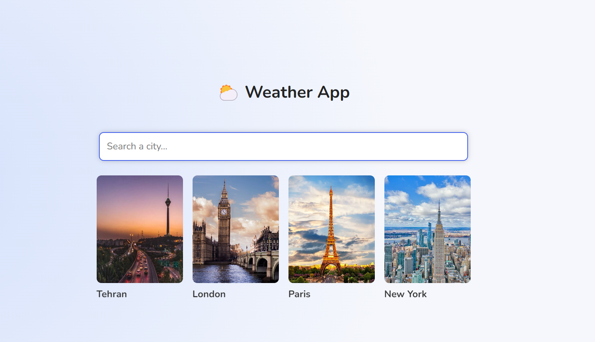
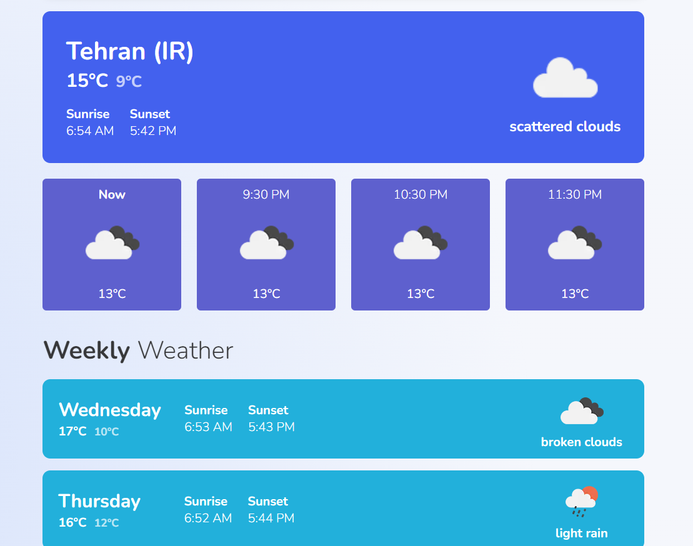

# Next.js Weather App ☀️🌦️🌈

Welcome to our Next.js Weather App project, where you can explore the weather with style and functionality! ☔


## Live Project 🌐

Explore the live Weather App [Live here](https://nextjs-weather-app-rahil1202.vercel.app/). Don't forget your umbrella! ☔

## Screenshots 📸

Witness the beauty of weather through our app:





## Getting Started

To embark on your weather journey, follow these simple steps:

```bash
npm run dev
# or
yarn dev
```

Open [http://localhost:3000](http://localhost:3000) in your browser, and the weather world will unfold before your eyes. 🌎

You can start your exploration by editing `pages/index.js`. Watch as the page auto-updates, providing you with real-time weather information.

## Features 🌟

Our Weather App boasts a range of features to enhance your weather experience:

- **Sunset and Sunrise Times**: Stay in tune with the changing sky and plan your day accordingly.
  
- **Temperature Overview**: Get real-time temperature updates to prepare for the day's conditions.

- **Weekly Forecast**: Plan your week with a detailed forecast extending up to 7 days.

## API Routes

Explore additional weather data through API routes:

- [Current Weather](http://localhost:3000/api/current-weather): Real-time current weather data.
  
- [Weekly Forecast](http://localhost:3000/api/weekly-forecast): A glimpse into the weather for the week.

## Learn More About Weather

If you want to deepen your understanding of weather phenomena, check out the [Weather Basics](https://weather.com/science/weather-basics) guide.

## Deploy on Vercel 🚀

Ready to share your personalized weather app? Deploy it seamlessly on the [Vercel Platform](https://vercel.com/new?utm_medium=default-template&filter=next.js&utm_source=create-next-app&utm_campaign=create-next-app-readme).

Explore our [Next.js deployment documentation](https://nextjs.org/docs/deployment) for a smooth deployment process.

Feel free to contribute and enjoy the weather journey! 🚀🌞
